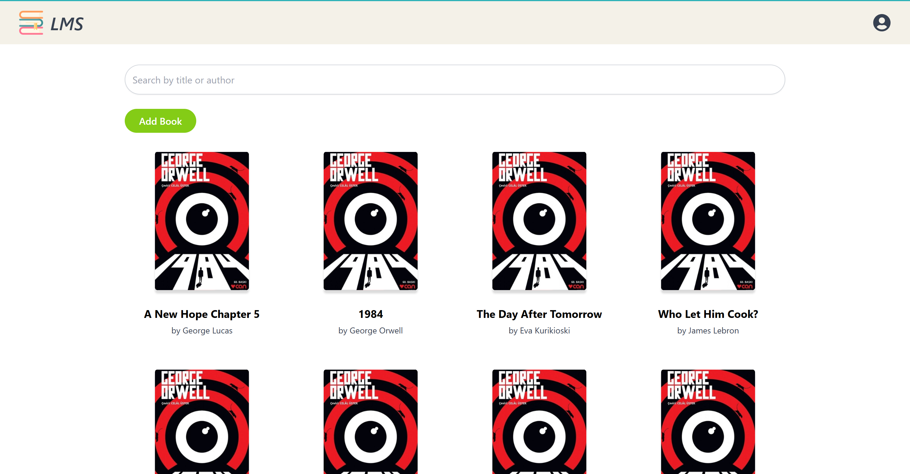
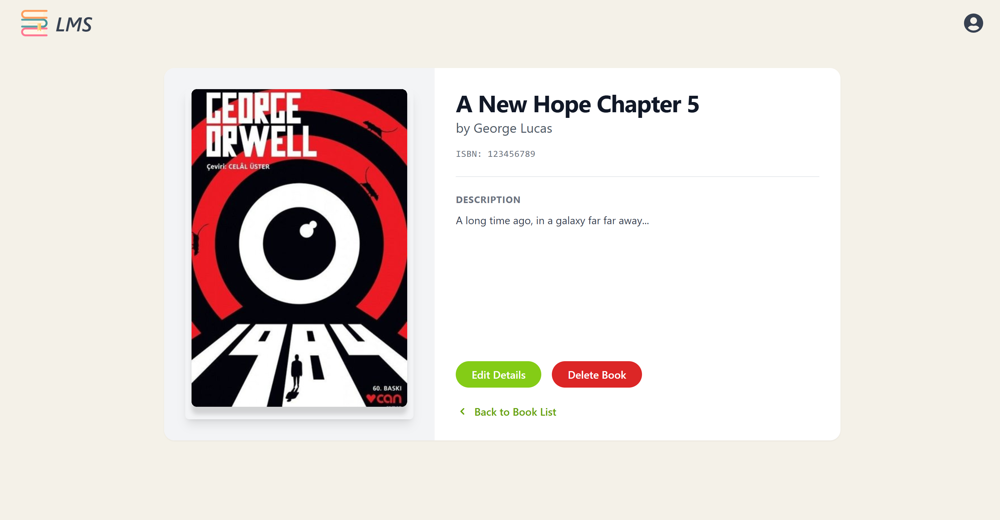
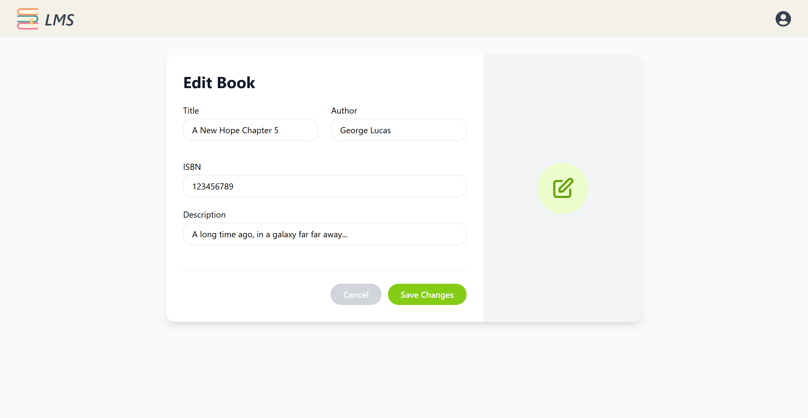
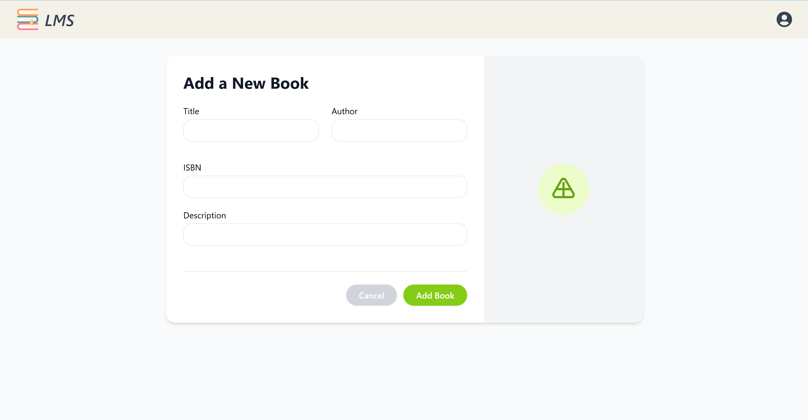

# Library Management System (LMS)

A full-stack web application for managing books in a library. Built with:

- Frontend: React + Tailwind CSS + React Router
- Backend: Node.js + MongoDB (for database)

## 🚀 Features

- View a list of books with search and pagination
- View book details
- Add, edit, and delete books (authenticated users only)
- JWT-based authentication (login/signup)

## ⚙️ Installation
### 1. Clone the Repository

```bash
git clone https://github.com/TheoKevH/library-management-system.git
```

### 2. Install Dependencies
```bash
cd backend
npm install
```
```bash
cd ../frontend
npm install
```
### 3. Create Environment Variables
Create a .env file (backend/.env) with the following:

`PORT=5000

MONGO_URI=<your_mongodb_connection_string>

JWT_SECRET=your_super_secret_key
`

### 4. Run the program
Backend:
```bash
cd backend
npm run dev
```

Frontend:
```bash
cd ../frontend
npm start
```

### Screenshots 





